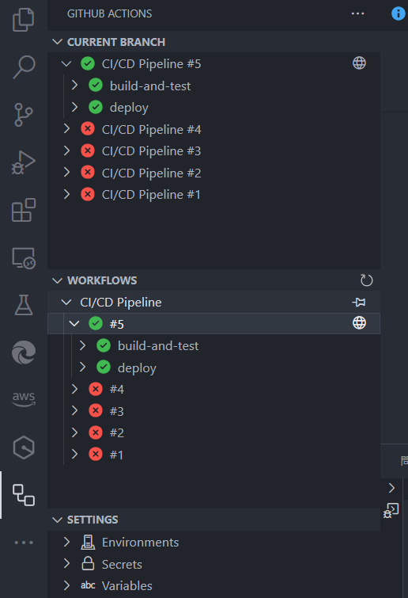

#API Automation Demo

##概述
API Automation Demo 是一個基於 FastAPI 的項目，旨在展示如何開發和測試高效的 API，並通過 Docker 和 CI/CD 工具實現自動化部署與運行。

##功能特性

- 用戶管理：支持用戶註冊和登入，並使用 JWT 驗證受保護的路由。
- 測試覆蓋：包含單元測試和集成測試，驗證 API 的核心功能。
- Docker 化：支持通過 Docker 部署。
- CI/CD 集成：通過 GitHub Actions 自動化測試和部署。
- 互動式 API 文檔：支持 Swagger（可通過 /docs 訪問）。

快速開始

1. 環境需求
   Python 3.10+
   Docker 和 Docker Compose

2. 本機運行
   （1）安裝依賴
   pip install -r requirements.txt

（2）運行應用
uvicorn api.main:app --reload

（3）訪問應用
主頁面：http://127.0.0.1:8000/
API 文檔（Swagger）：http://127.0.0.1:8000/docs

3. 使用 Docker 部署

（1）構建並運行
docker-compose up --build

（2）確認運行
檢查應用日誌：
docker-compose logs
在瀏覽器訪問：http://127.0.0.1:8000

4. 運行測試
   （1）本機測試
   確保應用正在運行：
   pytest tests/

（2）通過 Docker 測試
在 Docker 容器內運行測試：
docker-compose run web pytest tests/

##技術詳情

依賴
主要依賴的技術和庫包括：

FastAPI：後端框架，用於構建高性能 API。
Pydantic：數據驗證與模型管理。
Uvicorn：ASGI 服務器。
Pytest：測試框架。
Docker：容器化部署。
GitHub Actions：自動化測試和部署。
CI/CD 流程
專案使用 GitHub Actions 進行 CI/CD，包含以下步驟：

拉取代碼並安裝依賴。
運行測試，確保核心功能正常。
自動構建 Docker 映像並啟動應用容器。
配置文件位於 cicd/github-actions.yml。

注意事項
請確保 requirements.txt 與應用代碼一致，避免因依賴版本引發問題。
部署前可根據環境調整 docker-compose.yml 或環境變數。

